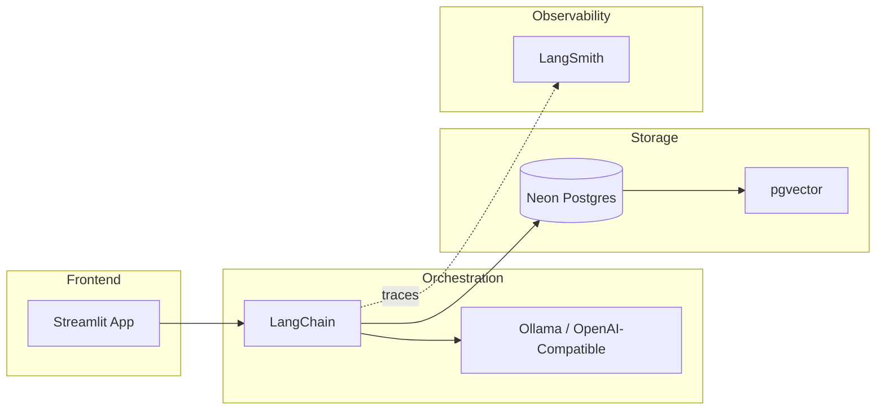

# SentinelRAG - Project Memory

## Overview
SentinelRAG is a production-grade RAG (Retrieval-Augmented Generation) application 
for security intelligence. It enables natural language queries against a database 
of security vulnerabilities.

## Architecture



## Tech Stack
| Component | Technology | Purpose |
|-----------|------------|---------|
| Frontend | Streamlit | Interactive web UI |
| Orchestration | LangChain | RAG pipeline management |
| LLM | Ollama / OpenAI-compatible | Response generation (configurable) |
| Vector DB | Neon Postgres + pgvector | Embedding storage & similarity search |
| Embeddings | Ollama / OpenAI-compatible | Text vectorization (configurable) |
| Observability | LangSmith | Tracing, debugging, evaluation |

## Security Rules

> [!CAUTION]
> These rules are NON-NEGOTIABLE for production code.

### 1. No Hardcoded Secrets
- **NEVER** commit API keys, database credentials, or tokens to git
- All secrets MUST be loaded from environment variables
- Use `.env` for local development (gitignored)
- Use `.env.example` as a committed template with placeholder values

### 2. Environment Variable Pattern
```python
# ✅ CORRECT
import os
api_key = os.getenv("OPENAI_API_KEY")

# ❌ WRONG
api_key = "sk-..."  # Never do this
```

### 3. Required Environment Variables
| Variable | Description |
|----------|-------------|
| `OPENAI_API_KEY` | API key (use 'ollama' for local Ollama) |
| `OPENAI_BASE_URL` | Endpoint URL (e.g., `http://localhost:11434/v1` for Ollama) |
| `LLM_MODEL` | Model name (e.g., `llama3.2`, `gpt-4o-mini`) |
| `EMBEDDING_MODEL` | Embedding model (e.g., `nomic-embed-text`) |
| `NEON_DATABASE_URL` | Postgres connection string from Neon |
| `LANGSMITH_API_KEY` | LangSmith API key for tracing |
| `LANGSMITH_PROJECT` | LangSmith project name |

### 4. Database Security
- Use parameterized queries only (SQLAlchemy or psycopg2 parameters)
- Never interpolate user input into SQL strings
- Connection strings must use SSL (`sslmode=require`)

### 5. Input Validation
- Sanitize all user inputs before processing
- Limit query length to prevent abuse
- Log suspicious activity patterns

## Development Workflow

1. **Setup**: Copy `.env.example` to `.env` and fill in credentials
2. **Install**: Run `uv sync` to install dependencies
3. **Database**: Run `uv run python src/db_setup.py` to initialize tables
4. **Run**: Execute `uv run streamlit run app.py`
5. **Monitor**: Check LangSmith dashboard for traces

## Key Design Decisions

- **Modular src/ structure**: Enables unit testing of individual components
- **Centralized config**: Single `config.py` prevents scattered env reads
- **Standalone db_setup**: Database initialization decoupled from app runtime
- **LangSmith integration**: Observability from day one, not an afterthought
